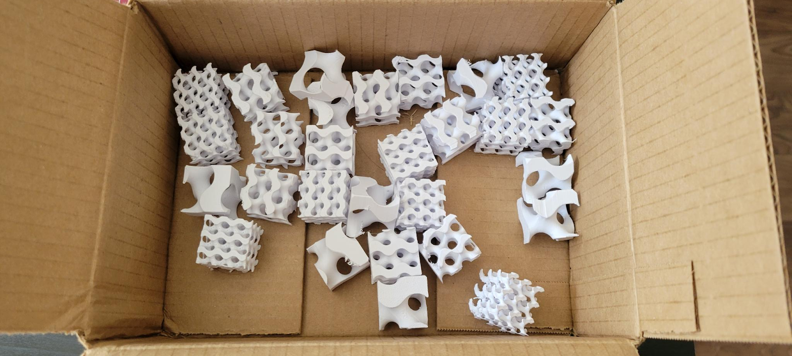

# Gyroid Measurement Experiment

This project explores the optimization of 3D-printed gyroid structures for enhanced energy absorption through a full-factorial experimental design. We systematically varied two key variables within the design space to predict energy absorption. Utilizing FDM 3D printing, Instron compression testing, and MATLAB analysis, we generated force-displacement data and fit a quadratic regression model to quantify energy absorption.

**My primary contributions to this project involved scripting (STL generation, plotting, and data analysis) and designing the experimental framework. I strategically chose the design variables and hypothesis testing to guide our outcome analysis.**

## Outcomes
- Successfully tested 27 gyroid specimens across nine geometric configurations with controlled FDM printing and Instron compression.
- Developed a quadratic regression model (R² = 0.94) predicting energy absorption based on isovalue and unit cell density, confirming statistically significant geometric interactions.
- Established a reproducible workflow for data-driven optimization of lattice structures, including MATLAB scripts for gyroid generation, testing data analysis, and hypothesis testing.
- Published a [comprehensive final report (PDF)](assets/gyroid/Optimization_of_Gyroids.pdf) and [summary slides (Google Slides)](https://docs.google.com/presentation/d/1YsgTZT92xVAr_GbYvnbmOabK2q4YTHSgumDWQ4tdrUo/edit?usp=drive_link).

## Skills Demonstrated
- **Experimental Design & Instrumentation.** Calibrated and executed Instron compression tests, meticulously ensuring accurate force and displacement measurement.
- **Data Analysis & Statistical Modeling.** Processed load-displacement data, accurately computed mechanical energy absorption, and applied regression modeling and hypothesis testing to validate findings.
- **Scientific Communication.** Designed useful and visually compelling figures that effectively communicate data insights and highlight key trends. Technical writing is also included in the presentation.
- **Additive Manufacturing.** Generated and 3D-printed precise gyroid geometries using MATLAB and FDM slicing software, demonstrating expertise in fabrication techniques.
