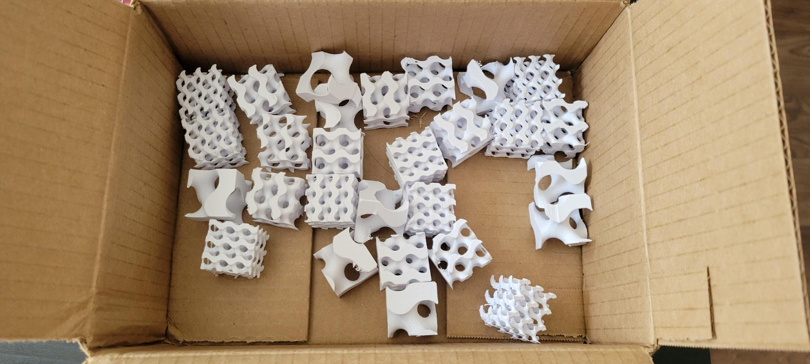
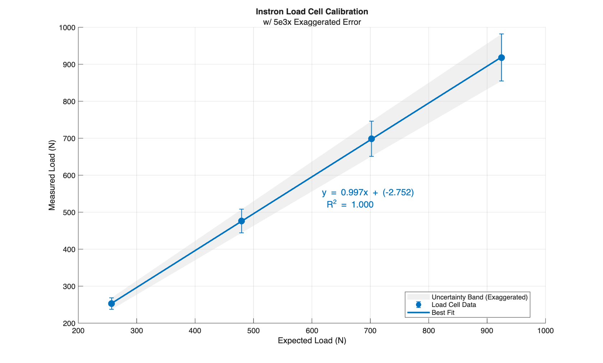
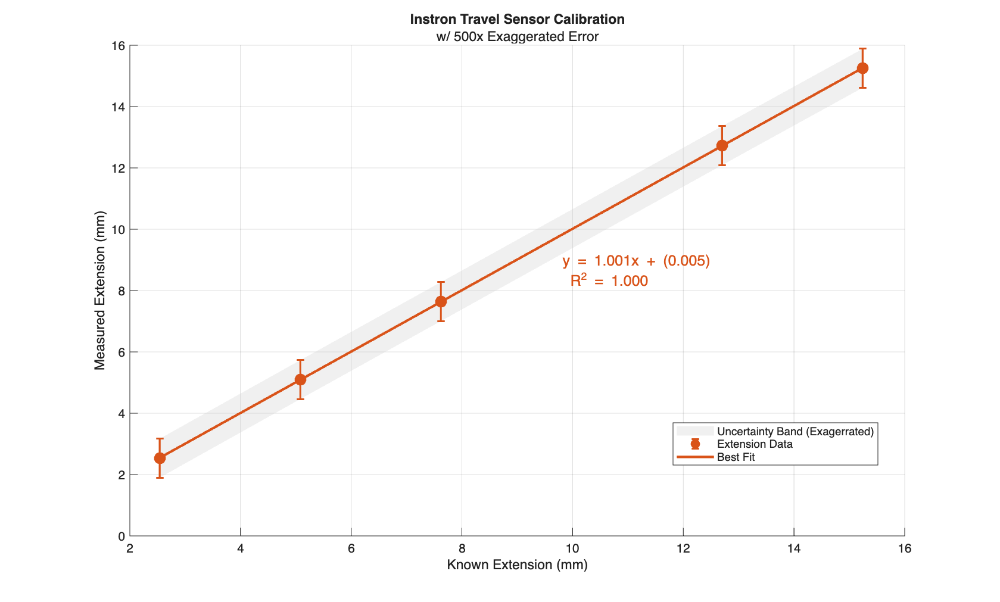
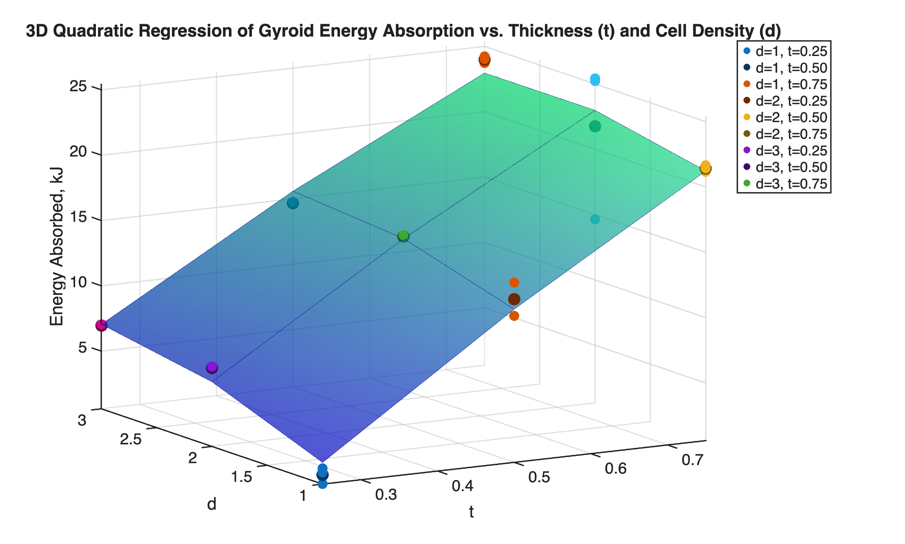

# Gyroid Measurement Experiment

This project explores the optimization of 3D-printed gyroids for enhanced energy absorption. By crushing lattice structures across a varied design space, we identified the non-linear "sweet spot" for mechanical performance.

**I owned the experimental design, MATLAB automation, and statistical modeling for the project.**

> **Note:** This page is a **summary**. For full documentation, see [Comprehensive Final Report (PDF)](../assets/gyroid/Optimization_of_Gyroids.pdf) and [Summary Slides (Google Slides)](https://docs.google.com/presentation/d/1YsgTZT92xVAr_GbYvnbmOabK2q4YTHSgumDWQ4tdrUo/edit?usp=drive_link) explaining the results of our work.

## Skills Demonstrated
- **Experimental Design & Instrumentation.** Calibrated and executed Instron compression tests, ensuring accurate force and displacement measurements.
- **Data Analysis & Statistical Modeling.** Processed load-displacement data, computed mechanical energy absorption, and applied regression modeling and hypothesis testing to confirm findings.
- **Scientific Communication.** Designed useful and compelling figures that communicate data insights and highlight key trends. Technical writing is also included in the presentation.

## Experimental Design & Test Matrix

We mapped a 2D design space by varying isovalue (t) and unit-cell density. This 3×3 factorial design ensured we captured the full spectrum of the lattice's mechanical response.

| Runs | Isovalue (t) | Unit Cell Density |
| :---: | :---: | :---: |
| 1–9 | 0.25 | 1, 2, 3 Units |
| 10–18 | 0.50 | 1, 2, 3 Units |
| 19–27 | 0.75 | 1, 2, 3 Units |

> **Note:** Each configuration was tested in triplicate (n=3) to ensure statistical significance and minimize noise from FDM print variances.

## DAQ, Calibration, and Regression

Energy absorption (W) was calculated as the area under the force-displacement curve. Samples were compressed using an Instron Universal Testing Machine. The resulting data was processed through a quadratic regression model to visualize the performance "topography" of the gyroids.

# Calibration Results

# Result Topography

## Mechanical Observations & Variability

While the quadratic model provided a high global fit (R² = 0.94), local deviations were observed in low-isovalue samples. 

* **Manufacturing-Induced Anisotropy.** At lower isovalues, the FDM layer-height became significant relative to the strut's cross-sectional area. This increased the "grain" effect of the print.
* **Failure Mode Shift.** While high-density samples failed through predictable plastic deformation, low-isovalue samples transitioned to brittle delamination. This suggests that as the feature size approaches the manufacturing resolution, the material's inter-laminar bond strength becomes the dominant failure bottleneck rather than the lattice geometry itself.
