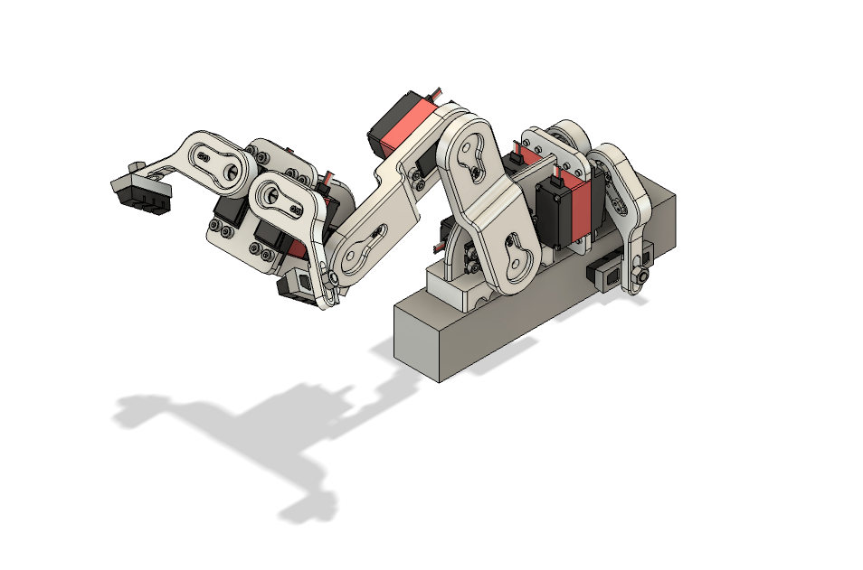
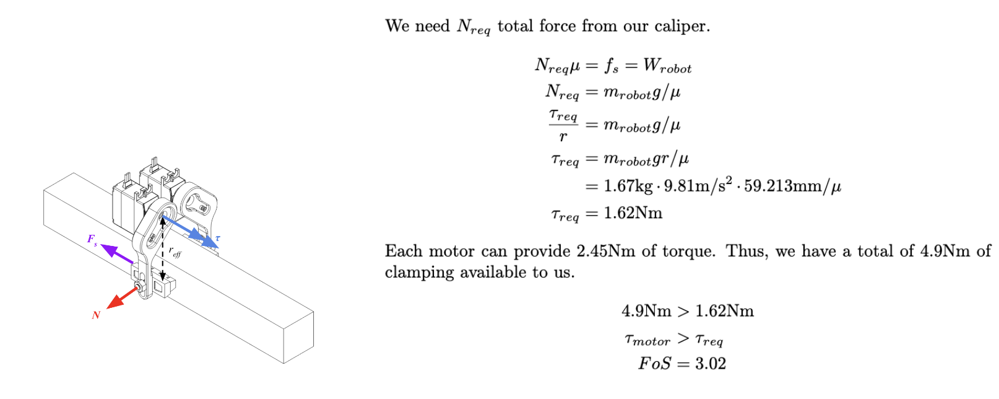
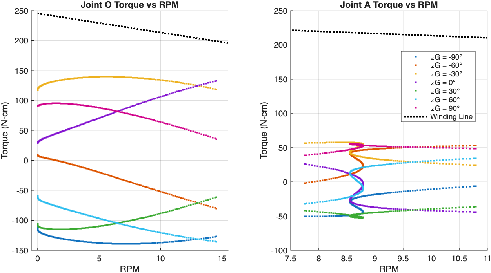
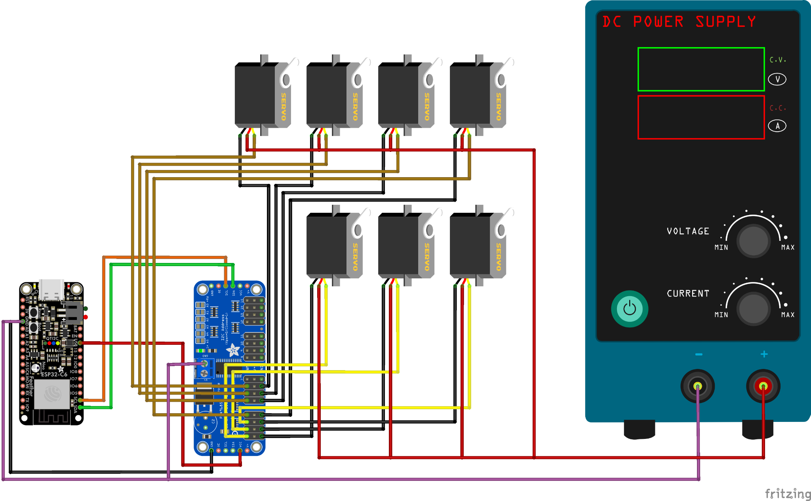

# Inchworm-Inspired Quasi-Static Robot Feasibility Study

This project is a theoretical and computational deep-dive into the locomotion of a two-link serial-chain climber. The goal was to mathematically determine the feasibility of quasi-static movement. We focused on ensuring that at every point in the gait, the robot maintains equilibrium and sufficient torque margins to counteract gravity without relying on dynamic momentum.

**I owned the kinematic derivation, MATLAB simulation environment, and mechanical synthesis.**

> [!note] Note:
> This page is a **summary**. For full documentation, see [Motion Analysis & Design Report (Google Slides)](https://docs.google.com/presentation/d/1YYxPU4BLg0zNh9PkcbEtMXNPjHYpkNcNU45CamPC_mA/).

## Skills Demonstrated
- **Kinematic Synthesis and Dynamics.** Derived closed-form geometric solutions for 2-DoF Inverse Kinematics and performed static force-balance equations to validate locomotion stability.
- **Component Validation.** Successfully proved feasibility of quasi-static motion path with given motor selection.
- **Path Generation.** I created a heuristic-based planner in MATLAB that computes joint angles for a smooth inchworm gait. This ensures the end-effector follows a prescribed path while staying within the verified torque-safe envelope.

## High-Level Strategy
This study investigated the viability of two-link robotic climber designed for complex curved horizontal and vertical environments. By leveraging a sequential anchoring gait, the architecture prioritizes mechanical reliability and high torque-to-weight ratios over systemic complexity.

The study prioritized a strategic reduction in system complexity to verify the platform’s core viability through two critical benchmarks:
- Validated the gripper-interface load capacity, ensuring reactive forces remained within factor-of-safety limits during critical transition phases.
- By targeting a quasi-static regime, we successfully minimized dynamic instability. Analytical modeling confirmed that inertial transients remained negligible, enabling high-fidelity trajectory tracking without the overhead of active-damping control systems.

## Gripper Mechanics: Frictional Anchor Validation

To ensure secure vertical attachment, the gripper architecture utilizes a high-friction caliper system based on established braking principles (such as those found in bicycles). By integrating COTS elastomeric pads (rubber-on-steel contact), the design maximizes the static friction coefficient (μ) required for stable load bearing.
- Based on a system mass of 1.67kg, the required torque to prevent slip was calculated at 1.62 Nm.
- With a dual-motor configuration providing a combined 4.9 Nm of clamping torque, the design achieves a Factor of Safety (FoS) of 3.02.

This 3x torque overhead ensures that the robot maintains a rigid anchor even under adverse conditions, such as surface contamination or dynamic load spikes during transitions.
## Lagrangian Based Quasi-Static Assumption
A critical component of the feasibility study involved mapping the robot’s dynamic demands against the actuator’s winding-limited operating space. Analytical modeling of the torque-speed requirements confirmed that even at peak velocities, the demand curve remained substantially below the motor’s winding line, maintaining a minimum 100 N-cm torque buffer. This validates that the system operates entirely within the efficient, linear regime of the motor and that a quasi-static assumption for locomotion was valid.

> Figure: Dynamic loading trajectories across various path angles (colored) plotted against the servo’s winding-limited operational boundaries (black).
## Kinematic Modeling and Workspace Analysis
To ensure seamless transitions between anchor points, I developed a kinematic simulation in MATLAB to identify and bypass singularities and unreachable configurations.

The motion planning utilized a sinusoidal path-mapping algorithm, which projected desired end-effector trajectories onto the climb path. To maintain physical feasibility, I implemented a workspace envelope constraint-checker that dynamically shifted out-of-bounds coordinates into the reachable manifold. This ensured fluid, quasi-static stability throughout the entire locomotion cycle.

# Electromechanical System Design

The proposed control architecture utilizes an ESP32 microcontroller communicating via I2C to a dedicated 16-channel PWM driver. This bus-based topology minimizes GPIO overhead and allows for synchronized control of the multi-actuator gait.

