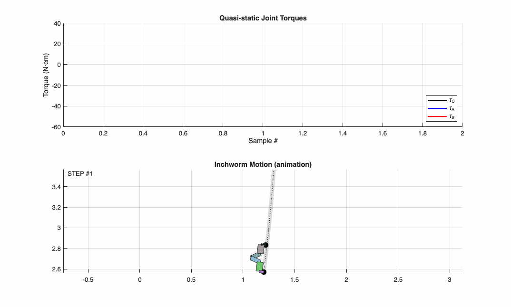

# Inchworm-Inspired Quasi-Static Robot Feasibility Study

This project is a theoretical and computational deep-dive into the locomotion of a two-link serial-chain climber. The goal was to mathematically determine the feasibility of quasi-static movement. We focused on ensuring that at every point in the gait, the robot maintains equilibrium and sufficient torque margins to counteract gravity without relying on dynamic momentum.

**I owned the kinematic derivation, MATLAB simulation environment, and mechanical synthesis.**

## Outcomes
- **Mathematical Validation.** Proved feasibility of vertical locomotion by mapping joint torque requirements against COTS actuator performance curves.
- **IK Solver Development.** Derived and implemented a 2D Inverse Kinematics (IK) solver in MATLAB to generate deterministic trajectories for arbitrary path profiles.
- **Technical Documentation.** Published a [Motion Analysis & Design Report (Google Slides)](https://docs.google.com/presentation/d/1YYxPU4BLg0zNh9PkcbEtMXNPjHYpkNcNU45CamPC_mA/).

## Skills Demonstrated
- **Kinematic Synthesis and Dynamics.** Derived closed-form geometric solutions for 2-DoF Inverse Kinematics and performed static force-balance equations to validate locomotion stability.
- **Computational Engineering.** Developed custom MATLAB scripts for trajectory visualization and automated torque-requirement plotting.

## Kinematic Modeling and Workspace Analysis

The study ensured the robot could transition between anchor points without entering singular or unreachable configurations.

- **Path Generation.** I created a heuristic-based planner in MATLAB that computes joint angles for a smooth inchworm gait. This ensures the end-effector follows a prescribed path while staying within the verified torque-safe envelope.