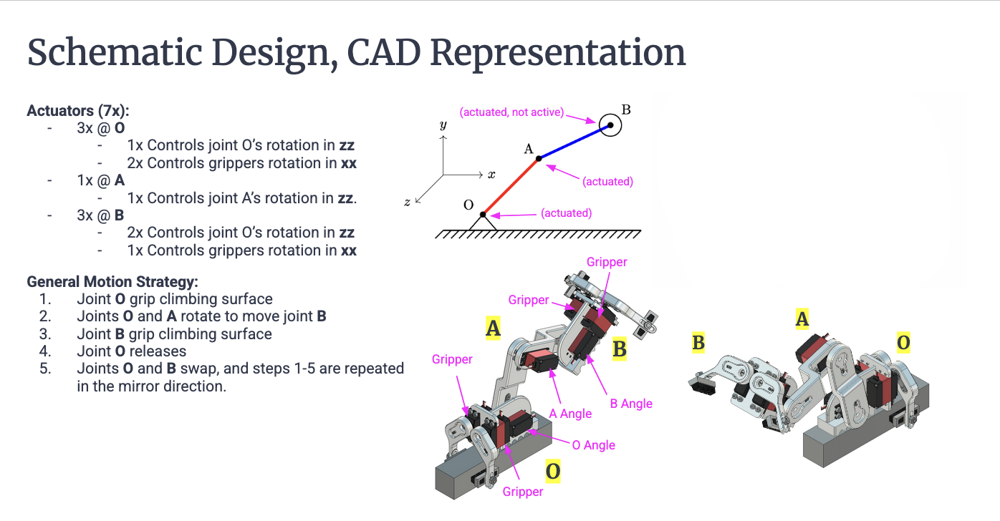

# Inchworm-Inspired Quasi-Static Robot Feasibility Study

This study validates the locomotion of a two-link serial-chain climber. The objective was to mathematically verify quasi-static movement, ensuring equilibrium and sufficient torque margins throughout the gait without relying on dynamic momentum.

**I owned the kinematic derivation, MATLAB simulation environment, and mechanical synthesis.**

>  **Note:** This page is a **summary**. Please see [Full Motion Analysis & Design Report (Google Slides)](https://docs.google.com/presentation/d/1YYxPU4BLg0zNh9PkcbEtMXNPjHYpkNcNU45CamPC_mA/) for more details.

## Skills Demonstrated
- **Kinematics & Dynamics:** Derived closed-form 2-DoF IK and static force-balance equations to ensure stability.
- **Component Validation:** Benchmarked motor torque-speed characteristics against predicted operational loads.
- **Path Generation:** Developed a MATLAB heuristic planner to ensure end-effector trajectories remain within the verified torque-safe envelope.

## High-Level Strategy
The architecture utilizes a **sequential anchoring gait** to prioritize mechanical reliability. Complexity was reduced via two strategic benchmarks:
- **Attachment Security:** Validated gripper-interface load capacity to maintain factor-of-safety limits during transitions.
- **Stability:** Targeted a **quasi-static regime** to negate inertial transients, enabling high-fidelity trajectory tracking without the need for active-damping controllers.

## Gripper Mechanics: Frictional Anchor Validation
The gripper utilizes a high-friction caliper system with **COTS elastomeric pads** (rubber-on-steel) to maximize the static friction coefficient ($\mu$).
- **Torque Demand:** 1.62 Nm (calculated from 1.67kg system mass).
- **Available Torque:** 4.9 Nm (Dual-actuator configuration).
- **Result:** **3.02 Factor of Safety (FoS)**.

This 3x overhead ensures a rigid anchor against surface variability and dynamic load spikes.

## Lagrangian Quasi-Static Verification
I mapped dynamic demands against the **actuator’s winding-limited operating space**. Modeling confirmed that even at peak velocities, requirements remained **100 N-cm below the winding line**. This validates that the system operates entirely within the motor's linear regime, confirming the quasi-static assumption.

> **Figure:** Dynamic load trajectories (colored) vs. winding-limited operational boundaries (black).

## Kinematic Modeling & Workspace Analysis
I developed a MATLAB simulation to identify singularities and unreachable configurations within the workspace.

A **sinusoidal path-mapping algorithm** projected trajectories onto the climb path, while a workspace constraint-checker dynamically shifted out-of-bounds coordinates into the **reachable manifold** to maintain fluid stability.

## Electromechanical System Design
The control architecture utilizes an **ESP32-C6** communicating via **I2C** to a 16-channel PWM driver. This topology minimizes GPIO overhead and ensures synchronized, low-latency control across the multi-actuator gait.

