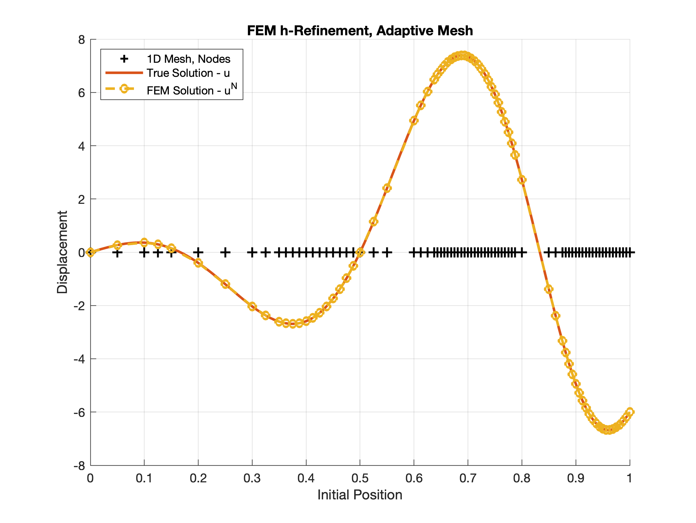

  
  

# Overview

This project marks the first half of a comprehensive MATLAB-based FEM solver, developed for ME C180 at UC Berkeley. It implements 1D Galerkin finite elements to solve structural and thermal boundary value problems. 

# Discussion

The solver handles both Dirichlet and Neumann boundary conditions and is capable of:
- Discretizing 1D domains using linear, quadratic, and cubic shape functions
- Assembling global stiffness matrices and force vectors efficiently
- Solving systems using sparse linear algebra routines
- Performing error estimation via the Principle of Minimum Potential Energy (PMPE)
- Executing adaptive h-refinement based on residual error
- Remeshing non-uniform domains to improve convergence

The code is modular, scalable, and runs on resource-constrained hardware without performance loss. It is designed to be runnable on weak hardware, including laptops and mobile phones.

Developing this solver required deep integration of mathematical theory with software engineering practices. Each feature from p-refinement, to adaptive meshing was implemented by hand, and validated through benchmark problems to confirm correctness and stability.

Core methods are based on _The Basics_, by Tarek Zohdi ([SpringerLink](https://link.springer.com/book/10.1007/978-3-319-70428-9)), a rigorous treatment of finite element fundamentals.
