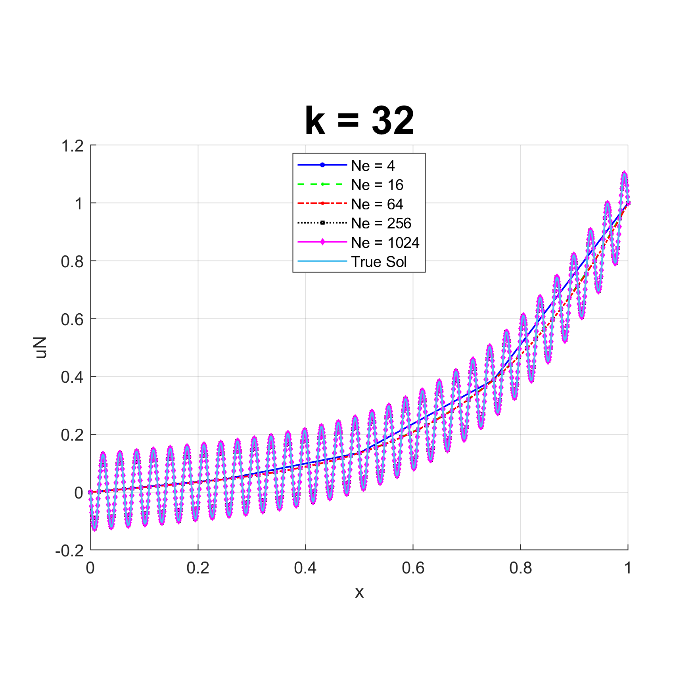

My FEM is a repository that contains a home-made Finite Element Method (FEM) solver for structural mechanics simulations in 1D, 2D, and 3D. Developed as part of coursework for ME C180 at UC Berkeley, it tackles a variety of FEM problems.

The solver is designed for high efficiency and capable of running on standard laptops and even smartphones. The solver was systematically analyzed and compared against benchmark problems to validate its accuracy.

The projects completed so far include:
- Initial set-up for 1D stick problems and error calculation for benchmarks.
- Higher order nodes (p-refinement) and remeshing for visual appeal.

Up next, I'm tackling:
- Automatic mesh refinement (h-refinement).

Over the course of eight distinct projects, it is being iteratively enhanced with various techniques like h-refinement, p-refinement, and even machine learning integration to improve its performance. The project successfully implemented 1D stick problem simulations, and 2D and 3D problem setups are currently in progress. The completed work is available for review on my [GitHub](https://github.com/eyandocumet/my-fem/).
