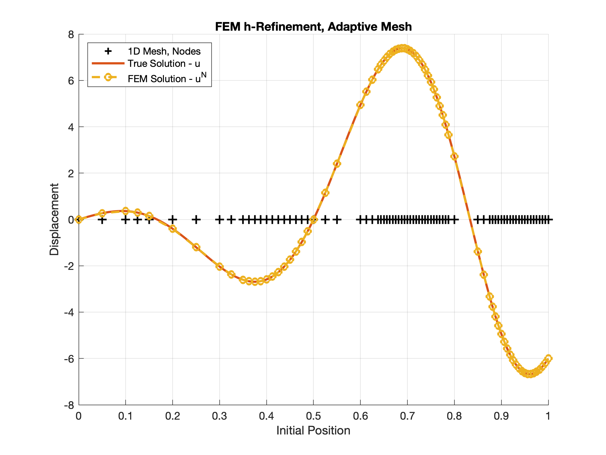
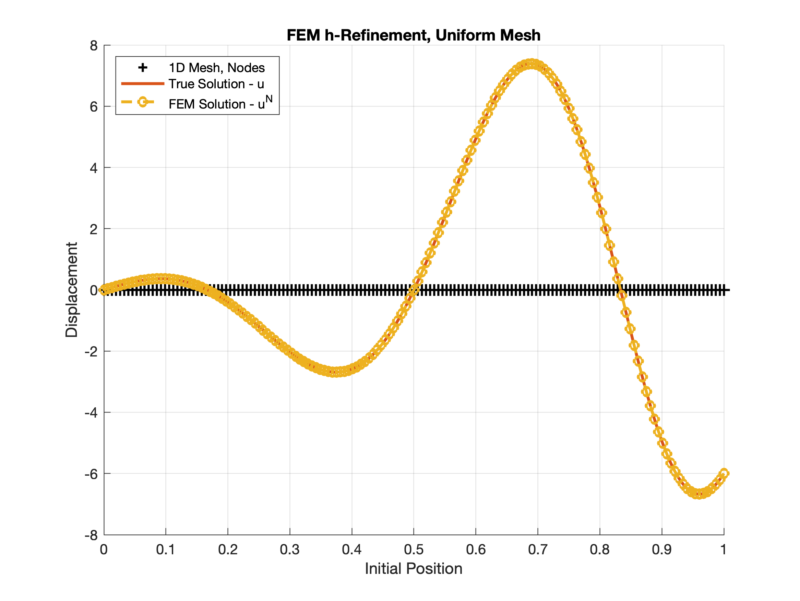
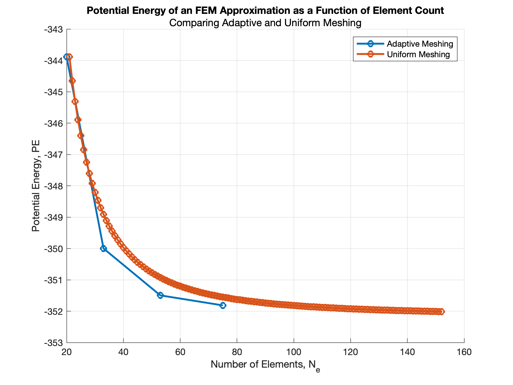

# Computational Mechanics: Finite Element Analysis

## Outcomes
- Adaptive h-refinement met error tolerances with 50% fewer elements (75 vs. 152) than uniform meshing.

- Verified that Conjugate Gradient (CG) iterations scale linearly with system size, though direct solvers remained faster for systems under 10k elements.

- Confirmed the Best Approximation Theorem by matching potential energy results across different numerical methods.

## Skills Demonstrated
- **Software Engineering.** Algorithm optimization, time-cost benchmarking, and automated mesh refinement in MATLAB.
- **Mathematics**. Numerical linear algebra, h-refinement, and error estimation via the Principle of Minimum Potential Energy.
- **Digital Twinning.** Developing predictive solvers that bridge the gap between theoretical models and high-fidelity numerical simulations.

## Adaptive h-refinement vs. p-refinement
While **p-refinement** increases the polynomial order of the basis functions to capture high-frequency oscillations, this project focused on **h-refinement** to maintain simplicity in element formulation. By surgically refining the mesh size ($h$) only in regions of high curvature, the adaptive strategy achieved a uniform error profile across the domain. This avoided the "over-solving" typical of uniform refinement, where computational resources are wasted on linear segments of the solution.

_*Note: This project was developed as part of the UC Berkeley MEC180 curriculum. Source code is withheld to comply with academic integrity policies._