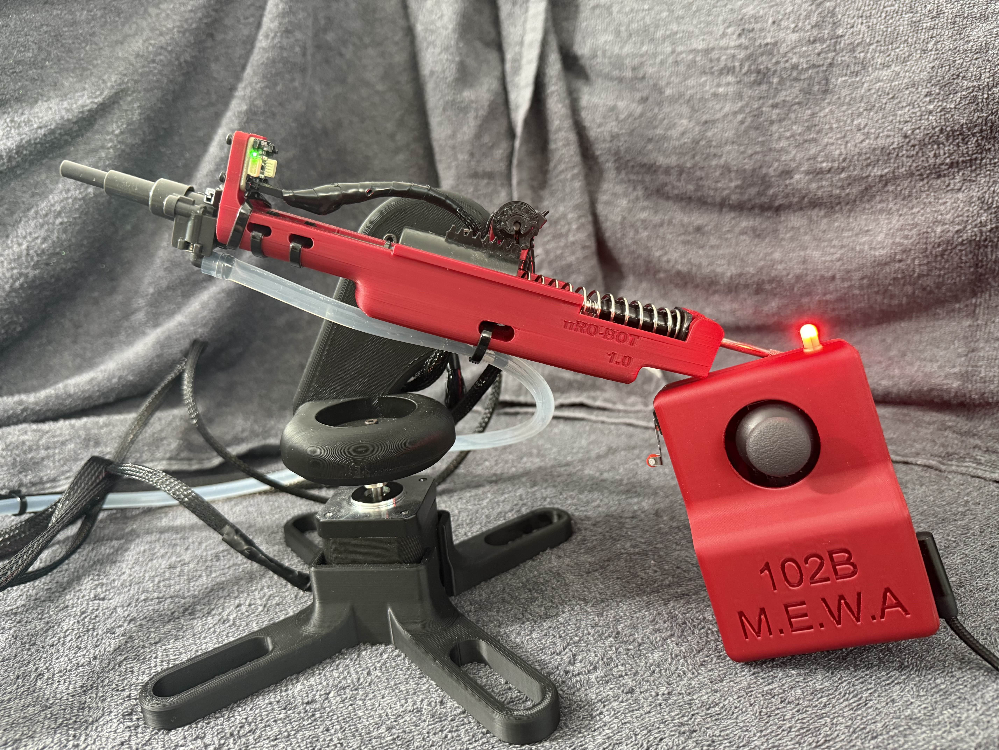
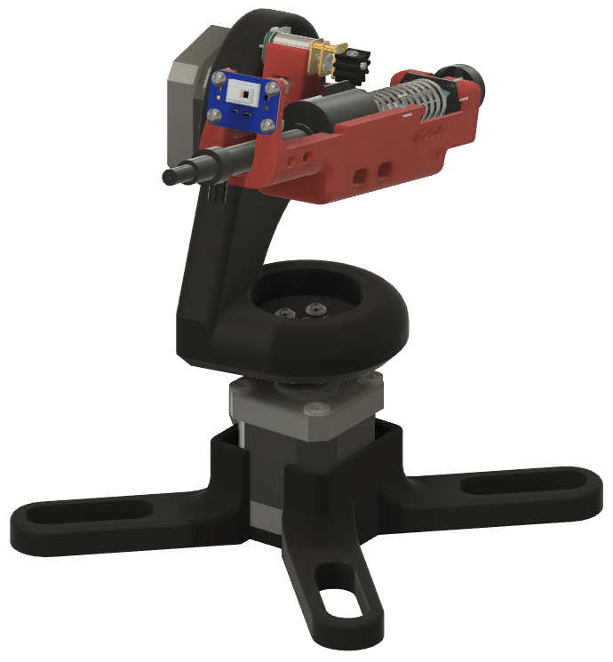
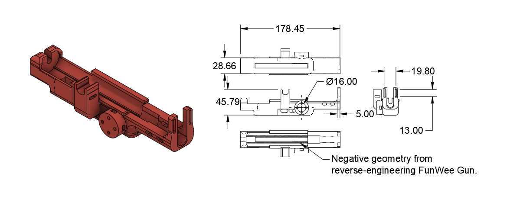
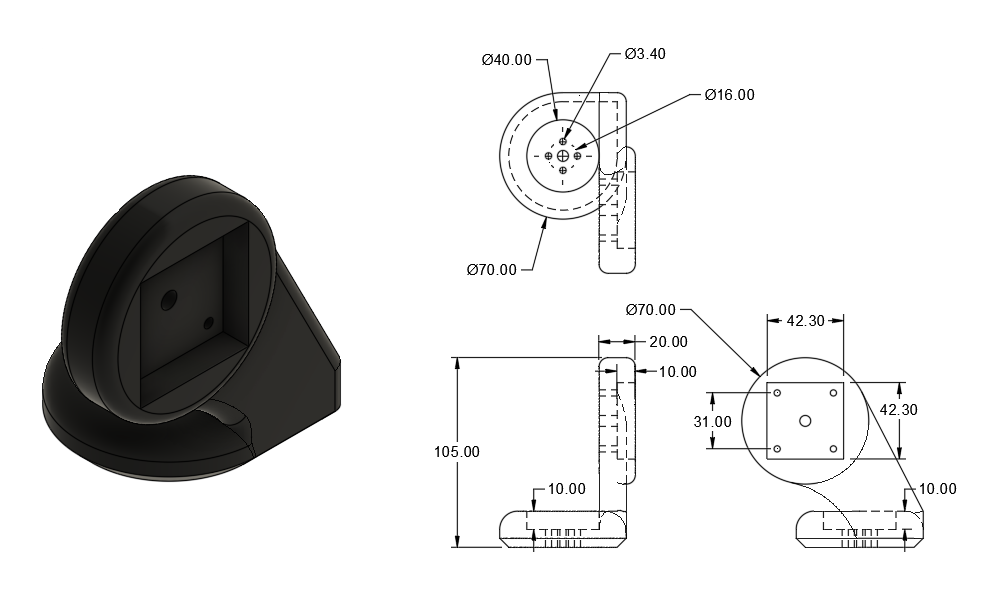
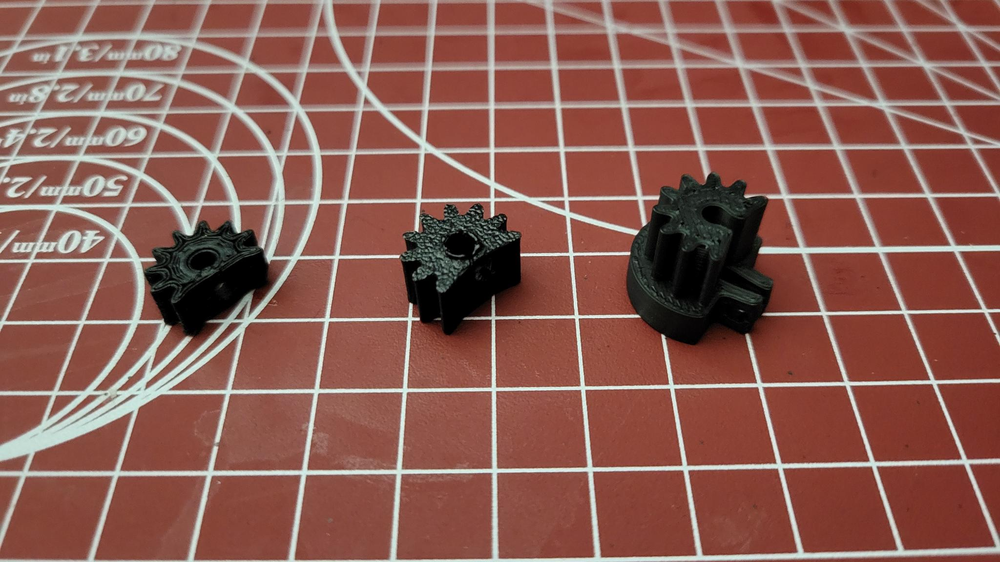

  

## Overview

πRo-Bot is a prototype fire suppression system engineered for operation in hazardous or remote environments. It consists of a 2.5DoF robotic turret, capable of detecting flames and delivering retardant (water in our case). The system supports both autonomous and manual operation modes and is also capable of preemptively applying retardant to mitigate fire spread.

  <video src="../img/pyro/pyro_demo.mp4" width="640" height="360" controls></video>

## Skills Demonstrated
- **Computer Aided Design** – Created maintainable parametric design using Fusion 360. Integrated top-down and bottom-up assembly.
- **Mechanical Design for Manufacturing (DFM)** – Optimized design for manufacturing on an FDM 3D printer. Minimized part count. Use of standardized ASME fasteners.
- **Embedded Systems** - Implemented event-driven architecture on an ESP32 microcontroller. Integrated sensor input and actuator control for autonomous operation.
- **Reverse Engineering** - Dissasembled an off-the-shelf device and created a "virtual twin" in CAD. Designed new subsystems around existing components.

## Mechanical Design
Fire response in hazardous or remote environments often places human lives at risk. My team sought to prototype an affordable, semi-autonomous robotic system capable of detecting and suppressing small fires in constrained or inaccessible locations.

As Mechanical Lead, I was responsible for the structural architecture, manufacturability, and subsystem integration of πRo-Bot’s physical platform. I designed the custom chassis and turret assembly using Fusion 360. Hand-calculations were used to confirm deflection limits, and ensure safe operation under expected loading conditions.

  

    
  

  

    
  

  

    
  

  

    
  

Several components required iterative redesign—most notably, the gear coupling our Pololu motor to the rack gear on the firing assembly, which was optimized through successive prototypes before converging on a shaft-collar mounting scheme and interference fit for secure power transmission.

  

## Outcomes
- Completion of a fully integrated, semi-autonomous fire suppression prototype with both manual and autonomous control modes.
- Successful thermal detection and event-driven suppression response tested under controlled conditions.
- Streamlined mechanical-electrical integration, enabling efficient maintenance, modular upgrades, and clear subsystem interfacing.
- Successful demo at semi-annual Jacobs Hall design showcase.
- Comprehensive reporting. [Available online](https://eyandocumet.xyz/img/pyro/ME102B_Final_Report_Group8.pdf).

\* *Special thanks to teammate Menooa Avrand for the creation of the demonstration video.*
