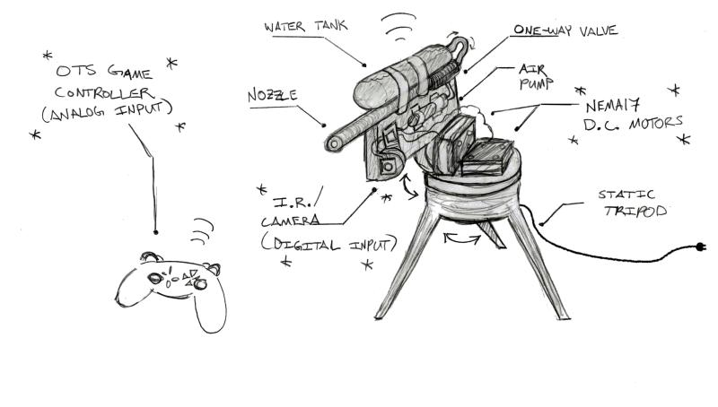
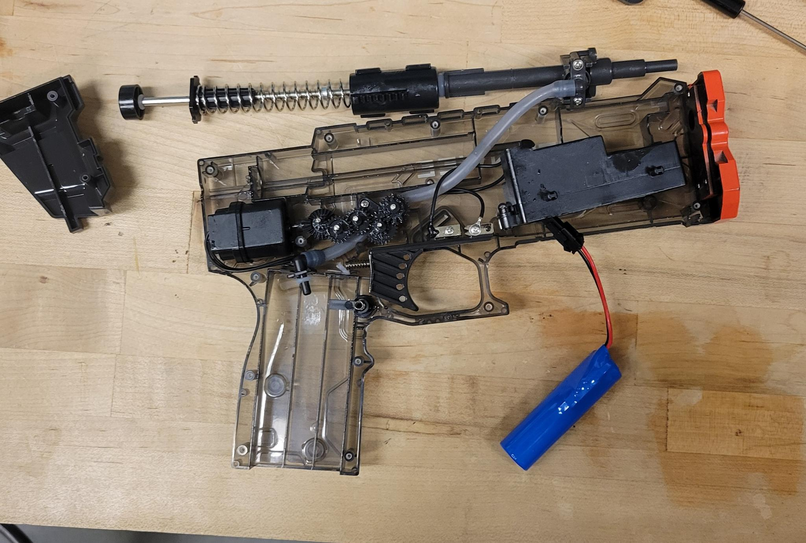
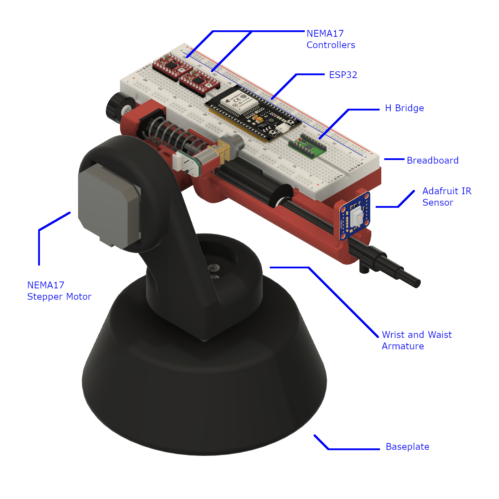
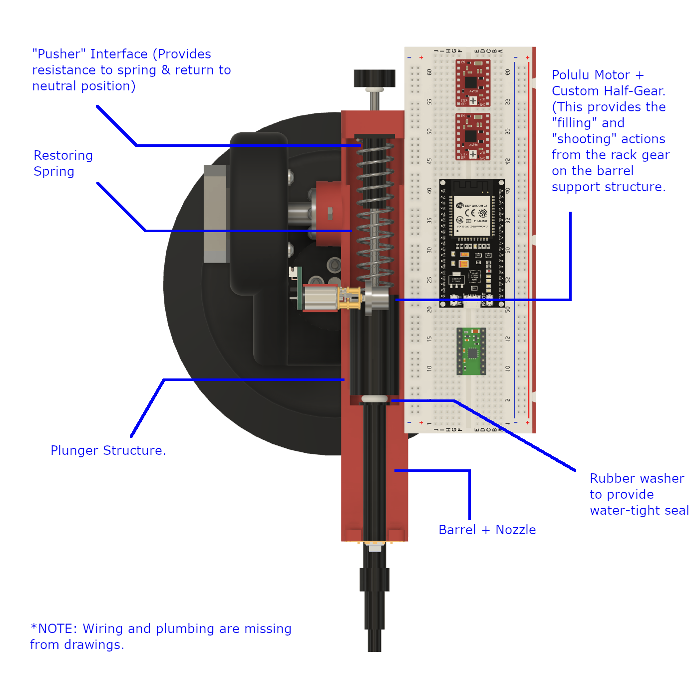
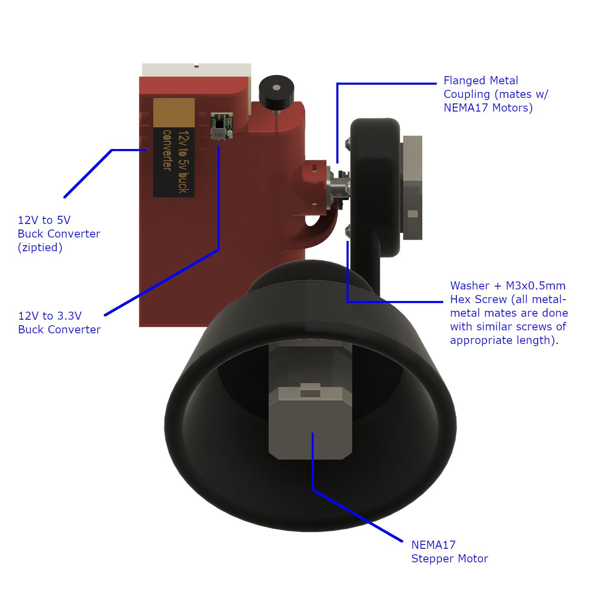
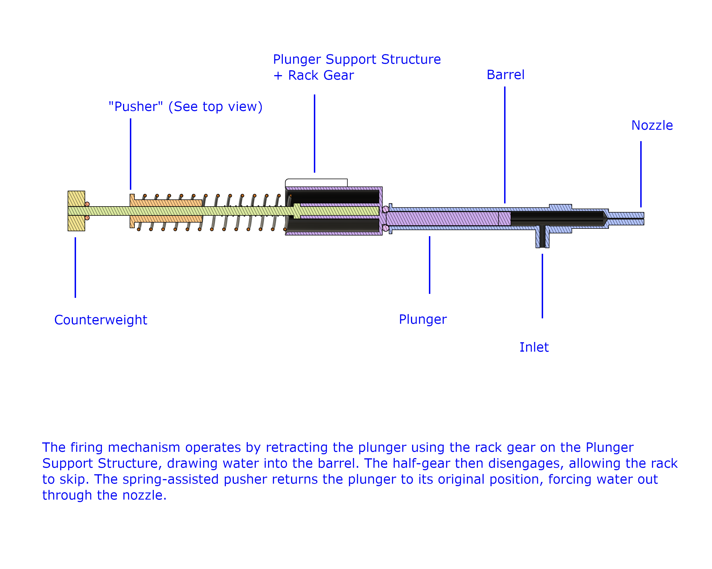
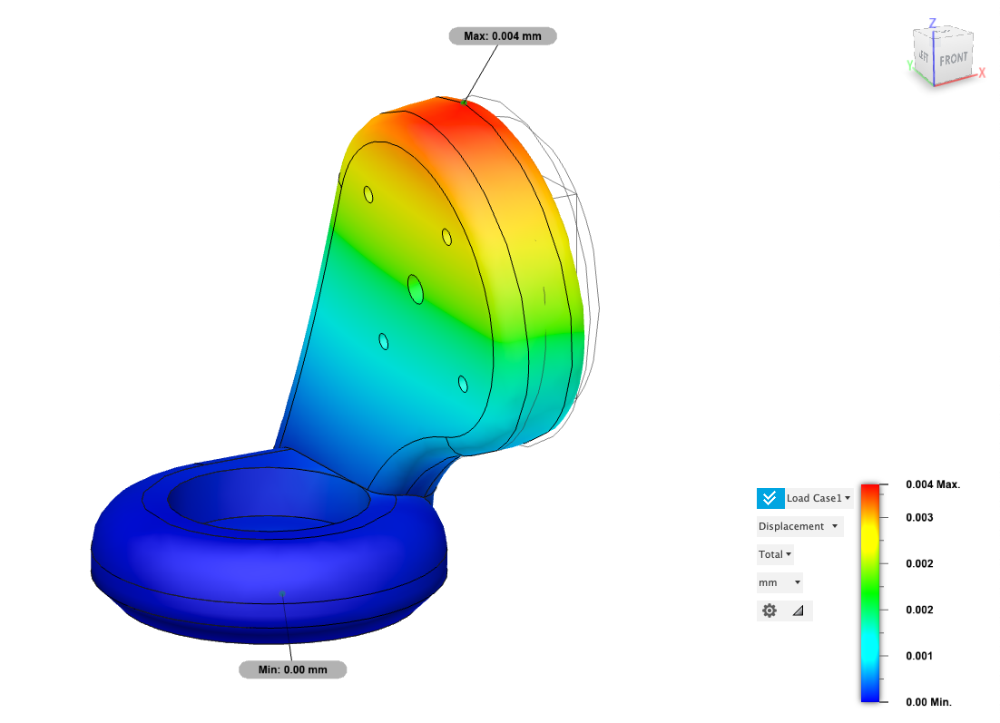

  

# Overview

πRo-Bot is a prototype, semi-autonomous fire suppression system engineered for operation in hazardous or remote environments. It consists of a 2.5DoF robotic turret, capable of detecting flames and delivering retardant (water in our case). The system supports both autonomous and manual operation modes and is also capable of preemptively applying retardant to mitigate fire spread.

# Skills Demonstrated
- **Computer Aided Design** – Parametric mechanical design using *Fusion 360*, including assemblies, joints, and toleranced components.  
- **Mechanical Design for Manufacturing (DFM)** – Use of standardized ASME fasteners, fits, and allowances tailored for 3D-printed components.  
- **Hardware Selection & Integration** – Specification of motors, transmission, and mechanical-electrical interfaces.  
- **Prototyping & Fabrication Planning** – Shop consultation, iterative design validation, and PLA-based 3D printing workflow execution.
- **Embedded Systems** - Implemented control architecture on an ESP32 microcontroller, integrating sensor input and actuator control for autonomous operation.
- **Event Driven Programming** – Developed non-blocking firmware to coordinate scanning, targeting, and suppression behaviors based on real-time IR sensor data.

# Mechanical Design & Goals

As the Mechanical Lead for the project, I was tasked with designing our custom chassis and turret assembly, modeled in Fusion 360. I also selected hardware, including transmission components and NEMA 17 stepper motors for precise directional control. The design's structural integrity was validated using Fusion 360’s built-in finite element analysis (FEA). Our simulations confirmed that the design can withstand operational loads with acceptable deflection and safety margins. I collaborated directly with the programming and circuitry leads to ensure seamless subsystem integration.

Motion control and fire detection are handled by an ESP32 microcontroller running an event-driven architecture. The turret integrates an IR camera module for thermal targeting, feeding data to the onboard system to autonomously track and suppress heat signatures. Below is our original concept sketch, which guided our mechanical layout and subsystem integration:

  

To simplify overhead and reduce lead time, our team began the design process by acquiring a commercial electric water gun and disassembling it. We repurposed its components to serve as our water delivery system.

  

Key goals included successful suppression of small fires at distances of up to 6 meters, full functionality in scanning, suppression, and manual modes, and a sleek, modular design adaptable for vehicles or buildings. After the first design iteration, my team developed the following assembly:

  

    

      
    

    

      
    

  

  

    

      
    

    

      
    

  

All critical mates in our design are metal-to-metal, utilizing off-the-shelf coupling flanges along with standardized washers, nuts, and bolts. We used ASME-standard fasteners, as they are readily available in bulk at our local hardware supplier, simplifying procurement. Specifically, we selected M3 ASME B18.22M washers, ASME B18.2.4.1M nuts, and ASME B18.3.4M bolts. Standardization reduced the need for custom tolerancing and mating analysis.

# Manufacturing & Assembly

After meeting with a panel of machinists, we shared our design, as well as preliminary calculations for motor performance and reliability. We received feedback and the green light to manufacture our device. After some final design adjustments and structural validation (completed via Fusion 360’s FEA solver), we are currently proceeding to 3D printing of PLA components. At this point, we also received a Maker Grant from UC Berkeley's Chapter of the ASME. Additionally, we've begun implementing our code, which includes the IR sensor mentioned previously.

Key modifications from the previous design mainly include relocating most electronic components from the gun platform to the base of the system. This improves weight distribution and simplifies maintenance and installation for our prototype. 

  

    

      
    

    

      
    

  

