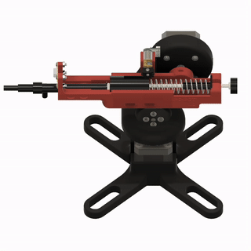

πRo-Bot is an autonomous fire suppression platform integrating a two-degree-of-freedom (2-DoF) robotic turret, designed for operation in hazardous or inaccessible environments. The system supports both manual and autonomous modes, enabling precise targeting and deployment of fire retardant. Autonomous operation allows for preemptive retardant application to limit fire propagation.

The chassis is modeled in Fusion360, while NEMA17 motors handle the arm’s movement for accurate targeting. The system is powered by an ESP32, running event-driven code to control scanning motions, with an IR camera mounted on the turret for fire detection. Here is my team's initial concept sketch:

  

Key goals include successful suppression of small fires at distances of up to 6 meters, full functionality in scanning, suppression, and manual modes, and a sleek, modular design adaptable for vehicles or buildings. The project is ongoing, with further enhancements planned.

After the first design iteration, my team has developed the following assembly:

  

    

      
    

    

      
    

  

Here's a preview of the device in motion, and the IR camera:

  

  

Project development is ongoing. After passing our initial design review and machine-shop consultation, my team is moving towards printing and testing our first physical prototype.
