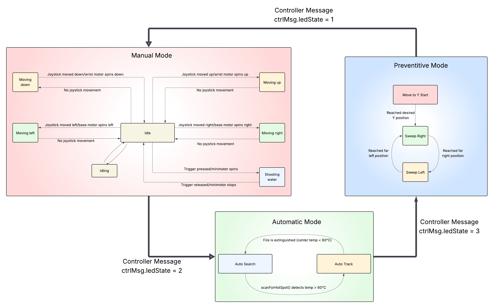
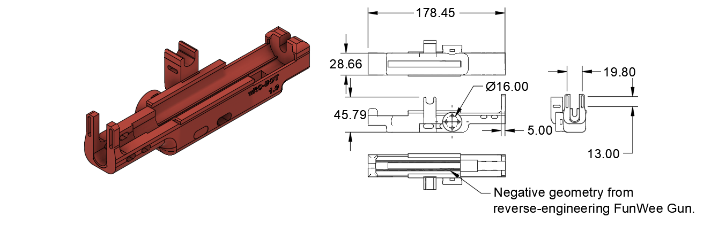
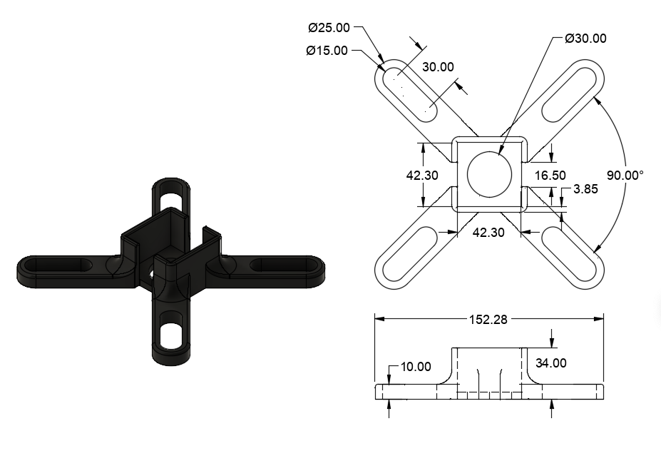

# PyroBot Fire Suppression System

Designed to minimize human risk in hazardous environments, PyroBot is a 2.5-DoF robotic turret that utilizes low-level computer vision to detect and extinguish thermal signatures.

**I owned the mechatronic design and co-developed the embedded vision pipeline for autonomous operation.**

<iframe width="560" height="315" src="https://www.youtube.com/embed/1t1cayGuPRw?si=kxGl0jnP1mP5C4o1" title="YouTube video player" frameborder="0" allow="accelerometer; autoplay; clipboard-write; encrypted-media; gyroscope; picture-in-picture; web-share" referrerpolicy="strict-origin-when-cross-origin" allowfullscreen></iframe>

> [!note] Note:
> This page is a **summary**. For full documentation, see 15-page [Technical Report and Operations Manual (PDF)](../assets/pyrobot/PyroBot_Final_Report.pdf) documenting the full system architecture.

## Skills Demonstrated
- **High-Density Mechatronic Integration.** Managed a 50+ part assembly, optimizing for volumetric efficiency and center-of-mass stability to ensure smooth 2.5-DoF motion.
- **DFMA & Rapid Prototyping.** Optimized geometries for FDM production, prioritizing anisotropic strength and minimizing post-processing. Utilized standardized ASME hardware to streamline the BOM.
- **Embedded Systems & FSM.** Implemented a non-blocking, event-driven architecture on an ESP32. Handled asynchronous sensor polling and high-resolution PWM actuator control.
- **Reverse Engineering & Metrology.** Disassembled complex COTS devices to extract and repurpose functional subsystems. Utilized precision metrology to validate virtual model accuracy for physical integration.

## Control Logic and Strategy

The system architecture follows a prioritized control logic managed by an ESP32-based Finite State Machine (FSM). This event-driven architecture allowed the robot to transition seamlessly between passive patrolling and active suppression modes (Automatic, Manual, and Preventative).

### Autonomous Heat Tracking
To ensure reliability in remote areas, all processing is performed locally on the ESP32. We utilized an **AMG8833 8x8 Infrared Thermopile Array** to generate a low-resolution thermal map. I co-developed a pipeline to interpolate this 64-pixel grid and implement peak-thresholding, localizing heat signatures with high angular accuracy at 10Hz.

### Reverse Engineering & Integration
To achieve high-velocity suppression within prototype constraints, we performed a full teardown of a COTS electric fluid delivery system. By extracting and characterizing the internal DC diaphragm pump, I was able to establish a Digital Twin in CAD. This allowed for the design of a custom mounting interface that balanced the pump's mass on the 2.5-DoF arm, reducing actuator moment of inertia and improving tracking stability.

## CAD & Layout Drawings

All components were engineered in Autodesk Fusion using a hybrid top-down assembly approach. Designs were specifically optimized for FDM 3D printing, prioritizing print orientation for structural integrity and maintaining 0.2mm tolerances for press-fit COTS integration.

