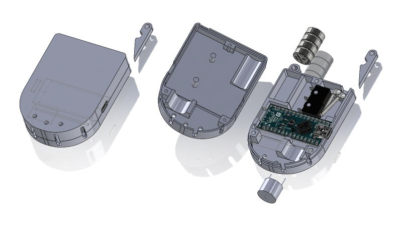
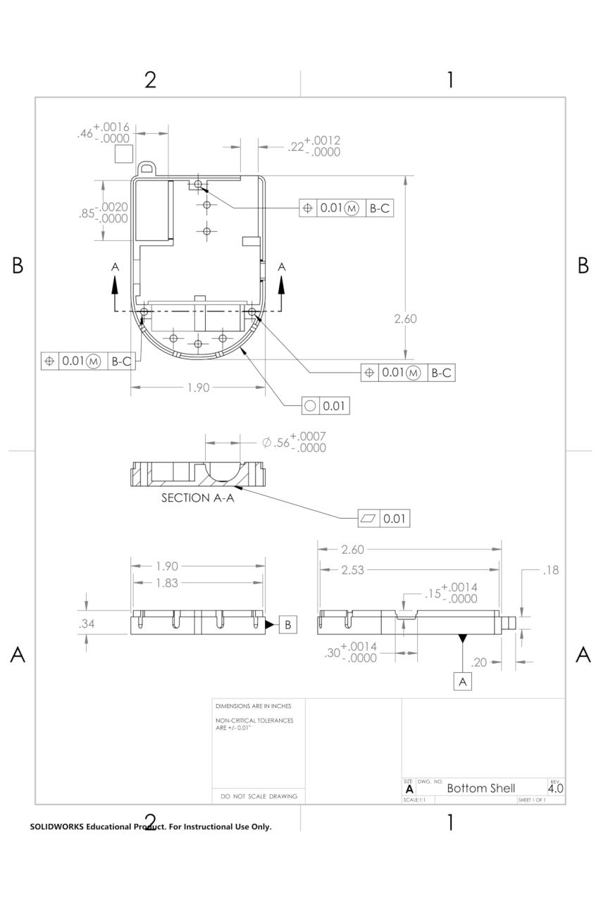

  

# Overview

The "Safety Grenade" is a wearable, throwable personal safety device designed to enhance communication during emergencies. Worn as a necklace, it amplifies the human voice and activates an alarm when pulled during an attack, drawing attention and signaling distress.

# Skills Demonstrated
- **Geometric Dimensioning & Tolerancing (GD&T)** – Applied GD&T principles for precise technical drawings and ensuring dimensional accuracy across components.  
- **Arduino & Electronics Design** – Developed the device's electronics using Arduino IDE, selecting components like the Arduino Nano and designing circuit schematics with KiCAD.  
- **Project Management** – Managed the project timeline, coordinated team tasks, and implemented an asynchronous work model to optimize efficiency for a team of four.  
- **Prototyping & Manufacturing** – Led the manufacturing of components, including 3D printing the chassis and integrating off-the-shelf parts for assembly.  
- **Iterative Design Process** – Led the team through several design iterations, testing and refining the prototype for optimal functionality and performance.

# Design & Development

As a Project Manager and Circuitry Lead to this project of four, I was responsible for ensuring compliance with project requirements, and designing the electronics using Arduino IDE and KiCAD. A significant part of the design process involved creating technical drawings of our components with Geometric Dimensioning and Tolerancing (GD&T) principles, ensuring each of the 8 components met strict dimensional and functional standards. I created detailed technical drawings for each component to ensure clarity in design communication and to facilitate assembly.

The design process required several iterations, and each component’s fit was carefully tested. The final prototype successfully showcased our team's design and was praised during the live demo presented to a panel of faculty and GSIs. Below is one of the design drawings created during the documentation phase:

  

# Manufacturing Plan

The fabrication process for the "Safety Grenade" involved the assembly of two main components: the chasis and the circuitry. The body of the device was comsisted of two FDM-printed (PLA) shells, mated together with a snap-fit.

The rest of the components consisted of:
- Pull-Pin
- Battery (Off-The-Shelf)
- Arduino Nano (Off-The-Shelf)
- Buzzer (Off-The-Shelf)
- Limit Switch (Off-The-Shelf)
- Lanyard (Custom Made)

# Reflection

This semester-long project was an excellent opportunity for me to demonstrate leadership and foster collaboration within my team. Although we faced some initial challenges during the ideation and coordination stages, I was able to guide the team through these hurdles with strategic decision-making and a focus on collaboration. As project manager, I took the initiative to implement an asynchronous work model, which helped our team of four busy college students remained aligned on deadlines and responsibilities.
